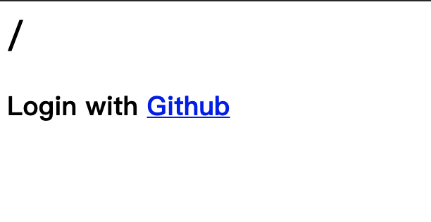
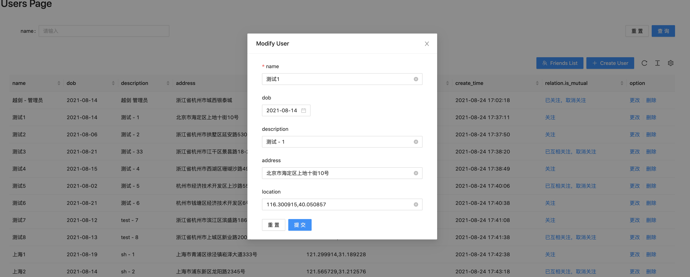
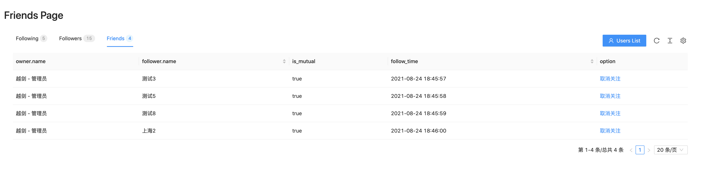

# Wiredcraft

Wiredcraft Backend Test

演示地址：[https://demo.msmao.com/](https://demo.msmao.com/)

使用 Github 账号登录

## 一、需求实现
### 1.1 用户信息的增删改查

用户信息的增删改查相关接口查看[文档](doc/API.md)

### 1.2 OAuth

已接入 GitHub OAuth

演示地址：[https://demo.msmao.com/](https://demo.msmao.com/)

### 1.3 日志

日志存储在 logs 目录下

1. appLogger wiredcraft-web.log，应用相关日志
2. coreLogger egg-web.log 框架内核、插件日志
3. errorLogger common-error.log 用此日志定位运行异常
4. agentLogger egg-agent.log agent 进程日志
5. customLogger wiredcraft.log 请求级别的的日志

查看[logs目录](logs/)

### 1.4 粉丝互相关注

设定用户关系为：followers 被关注 / following 关注，互为关注的朋友 friends 三种

数据结构模型，如下

```
// model/relation.js 

'use strict';

module.exports = app => {
  const mongoose = app.mongoose;
  const relationSchema = mongoose.Schema({
    owner: { // 关注者
      type: mongoose.Schema.Types.ObjectId,
      ref: 'User', // 关联用户表
      required: true
    },
    follower: {  // 被关注者
      type: mongoose.Schema.Types.ObjectId,
      ref: 'User', // 关联用户表
      required: true
    },
    is_mutual: { // 是否互为关注，true 为朋友，false 为单方面关注
      type: Boolean,
      default: false
    },
    createdAt: { // 关注时间
      type: Date,
      default: Date.now
    },
  });
  return mongoose.model('Relation', relationSchema);
}
```

查询、关注、取消关注接口查看[文档](doc/API.md)

### 1.5 根据经纬度坐标，用户名查找附近朋友

数据结构模型，如下

```
// model/user.js

...
// 地理位置坐标字段
location: {
  type: { type: String, enum: "Point", default: "Point" },
  coordinates: { type: [Number], default: [0, 0] },
},
...


// 建立地理位置坐标索引
db.getCollection('users').createIndex({location: '2dsphere'})
```

用户姓名搜索附近朋友接口查看[文档](doc/API.md)


### 1.6 单元测试

执行单元测试，目前时间关系只实现了健康检查接口

```bash
$npm test
```


## 二、技术栈

### 2.1后端
1. 开发语言使用 javascript，基于 egg node.js web 框架实现
2. 数据库采用 NoSQL MongoDB

### 2.2前端
1. 框架采用 React、Umi、Ant Design

### 2.3 运维
1. 前、后端分离，以 Docker 方式部署至 K8s


## 三、开发、部署

在 .env 配置文件中更改相关配置

```
// .env

MONGODB_URI = mongodb://mongo-svc:27017/wiredcraft
MONGODB_POOL_SIZE = 5

PASSPORT_GITHUB_CLIENT_ID = xxx
PASSPORT_GITHUB_CLIENT_SECRETS = xxx
```
### 3.1 本地开发

```bash
$ npm i
$ npm run dev // 自动启动前端 localhost:8000 端口
$ open http://localhost:7001/

// -----
// 或前端单独启动

$ cd web
$ yarn
$ yarn start
$ open http://localhost:8000/

```

### 3.2 本地部署

```bash
$ npm start
$ npm stop
```

## 演示截图







